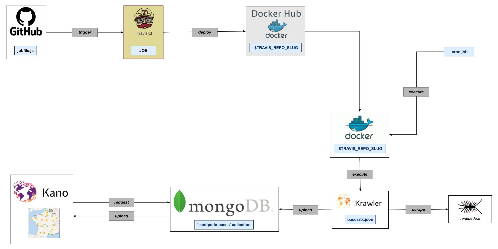

# Kalisio et le projet Centipède
## Centipède et la solution de webmapping *Kano*
### Les bases du webmapping
::: tip Définition Webmapping 
Correspond à la diffusion de données cartographiques par le biais d'un site web. Les informations affichées sont la réponse de requêtes clientes : on parle d'affichage dynamique.
:::

#### L'architecture d'une solution webmapping
Une solution webmapping s'articule atour de 3 piliers :
- Les requêtes ;
- Le traitement ;
- L'affichage.

##### Les requêtes
Une requête est une demande effectuée par l'utilisateur. Elle suit le protocole  de communication HTTP, et permet à l'utilisateur d'accéder à des ressources (docs HTML ou programmes) stockées dans des bases de données grâce à leur URL.

Une requête HTTP est composée d'un en-tête *HEAD* et d'un coprs *BODY* dans lesquels est encapsulée la requête selon une méthode choisie (GET ou POST majoritairement).

Un requête HTTP contient donc : 
- L'URL du fichier ou programme recherché ;
- La méthode de requête (GET, POST, etc.) ;
- Les paramètres que la ressource recherchée devra appliquer (taille, etc.).

Dans la majorité des sites web dynamiques modernes, les requêtes sont traitées par des *controls* Ils permettent de définir au sein d'une page HTML des objets Javascript, pour répondre localement aux requêtes client en arrière plan, sans recharger toute la page web. On parle de site web AJAX.

Ces sites AJAX sont agrémetés de composants pré-programmés nommés widgets. Ils facilitent le développement de sites web intéractifs. 

Finalement, un site de webmapping est un assemblage sur mesure de composants préprogrammés, capables de répondre à plusieurs types de requêtes clientes. On parle de *Mashup*.

##### Le traitement
Une fois la requête client émise, les logiciels de traitement localisent la ressource recherchée, l'exécutent si besoin, et retournent le résultat au client.

##### L'affichage 
Selon le format de la réponse reçue, l'affichage peut être direct (page HTML), ou indirect en faisant appel à des logiciels d'interprétation (Javascript, Flash, etc.). C'est notamment le cas des données vectorielles, qui nécessitent un traitement sur l'appareil client.

Selon la nature de la requête, la ressource peut aussi être stockée dans une base de données, pour un affichage ultérieur.

#### Interopérabilité et normes OGC
Les solutions webmapping font appel à de multiples serveurs géographiques. Pour garantir l'**interopérabilité** des données et services géographiques, l'Open Geospatial Consortium (OGC) a déceloppé des standarts de communicaction, de formatage et d'échange.

::: details WMS
Les services WMS (Web Map Service) permettent de mettre à disposition d’utilisateurs des **images géoréférencées**, via une simple requête HTTP, à partir de données sources raster (image) ou vecteur.

Les services WMS **calculent les images** demandées selon divers paramètres fournis dans la requête.

Les services WMS se composent de 3 requêtes : 
- *GetCapabilities* : renvoie les paramètres du service et les couches (une couche WMS correspond à une ressource) disponibles avec les informations permettant de paramétrer les requêtes suivantes ;
- *GetMap* : renvoie une image de la carte ;
- *GetFeatureInfo* : renvoie des informations sur les objets ayant servi à générer la carte (optionnelle).
:::

:: details WMTS
Les services d’images tuilées permettent de mettre à disposition d’utilisateurs distants des images géoréférencées, via une simple requête HTTP.

Ils mettent en œuvre le protocole WMTS (Web Map Tile Service).

Les requêtes WMTS sont des références directes aux images demandées dans un système de cache précalculé. Cela permet d’avoir des temps de réponse nettement plus rapides que pour le WMS qui doit calculer une image côté serveur à chaque requête.

Le cache d’images repose sur un maillage rectangulaire régulier de la zone couverte, une image étant associée à chaque maille (appelée aussi tuile). Pour pouvoir représenter cette zone à différents niveaux d’échelles (ou niveaux de zoom), des maillages de plus en plus fins sont définis pour la zone. Le cache d’images ainsi tuilées apparaît donc comme une pyramide dont chaque niveau de zoom représente un étage.
Chaque type de donnée servie (Orthoimagerie, cartes, …) nécessite ainsi le pré-calcul d’une telle cache dans une projection donnée, hébergée sur l’infrastructure Géoportail.

Pour obtenir une image, une requête WMTS comporte donc des paramètres précisant : le type de données (LAYER), la pyramide de tuiles (TILEMATRIXSET) et le maillage (TILEMATRIX) correspondant au niveau de zoom voulu et les coordonnées de la tuile dans ce maillage (TILECOL et TILEROW). ([IGN, 2023](https://geoservices.ign.fr/documentation/services/api-et-services-ogc#2430))
:::

:: details WCS
Le Web Coverage Service (WCS) est un service d'échanges de données raster complexes. Les données WCS sont souvent utilisées dans le cadre de modélisations, qui font appel à des données raster plus complètes que celles transportées grâce aux services WMS. 
:::

:: details WFS
Le service WFS permet aux utilisateurs de télécharger des données vectorielles géoréférencées.
:::

:: details CSW
Le service CSW du Géoportail permet d’interroger des catalogues de données.
:::

### Kano et Centipède
L'architecture de la solution webmapping Kano est articulée autour de 2 systèmes de requêtes imbriqués l'un dans l'autre, avec un point de croisement : le gestionnaire de bases de données MongoDB.

D'un coté, le JOB lance des requête régulières au serveur Centipède pour en récupérer la liste des bases disponibles et la stocker sur MongoDB. De l'autre, l'utilisateur interroge MongoDB (via Kano) pour en extraire la liste des bases précédemment collectée grâce au travail du JOB. 

Ce schéma récapitule ce système à double requêtes :

*
 Réponse à une requête utilisateur sur Kano
* 

## La doc Centipède de Kalisio
La création de cette documentation s'est déroulée en deux étapes :
- L'élaboration du contenu du site en local;
- La mise en ligne du site (uploading).

Pour ce faire, j'ai suivi le protocole suivant :

<mermaid> 
flowchart LR
    %%%%% OUTILS %%%%%
    subgraph A [USER]
        S([Script MarkDown])
    end
    subgraph B [GITHUB MASTER]
        direction LR
        K[(k-centipede)]-.->D1([k-centipede/workspace])
    end
    subgraph C [TRAVIS]
        J([JOB])-.->D2([DOCS])
    end
    subgraph D [DOCKERHUB]
        IM[(Images)]
    end
    subgraph E [GITHUB PAGES]
        H[(HTML files)]
    end
    %%%%% ACTIONS %%%%%
    S-->|commit|S
    A-->|push|B
    B---->|trigger|J
    J-->|deploy|D
    D2-->|deploy|E
</mermaid>

Ce second schéma représente le fonctionnement détaillé du logiciel *Travis* dans le cas du projet k-centipede porté par Kalisio :

<mermaid>
flowchart LR
    subgraph A [TRAVIS]
        J([JOB])-.->DO([DOCS])
    end
    T([travis.yml])---->J
    %%%%% JOB %%%%%
    %% OUTILS
    subgraph B [ ]
        direction TB
        subgraph B1 [ ]
            P([Provision])
        end
        subgraph B2 [DOCKER]
            X([Build])
        end
        subgraph B3 [DOCKERHUB]
            Z([Deploy])
        end
    end
    %% ACTIONS
    J-->B1
    B1-->B2
    B2-->B3
    %%%%%% DOCS %%%%%
    %% OUTILS
    subgraph C [ ]
        direction TB    
        subgraph C1 [YARN]
            PR2([Provision])
        end
        subgraph C2 [VUEPRESS]
            BU2([Build])
        end
        subgraph C3 [GITHUB]
            DE2([Deploy])
        end
    end
    %% ACTIONS
    C1-->C2
    C2-->C3
    DO-->C1
</mermaid>
