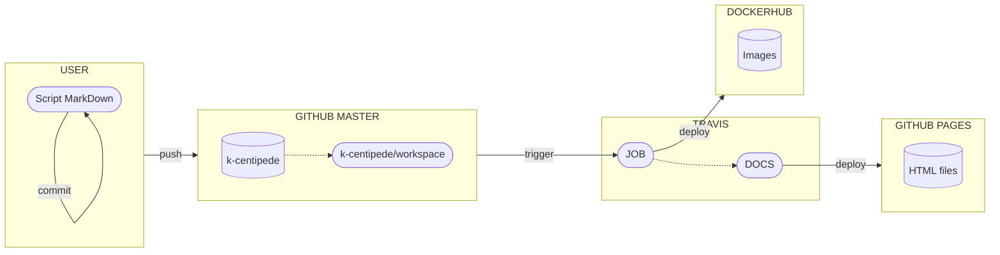
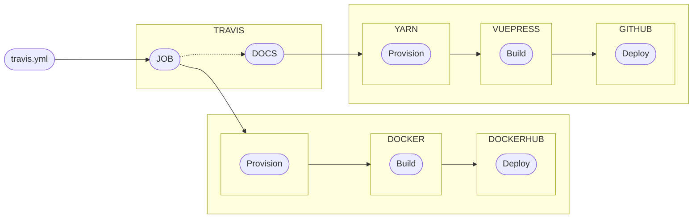

# A propos de ce site web
Ce site web statique regroupe l'ensemble de mes travaux effectués lors de mon stage chez [Kalisio](https://kalisio.com/). Il a été développé avec l'outil VuePress et repose sur l'ensemble des briques technologiques de l'entreprise (Travis, Docker, etc.).

La création de cette documentation s'est déroulée en deux étapes :
- L'élaboration du contenu du site en local;
- La mise en ligne du site (uploading).

Pour ce faire, j'ai suivi le protocole suivant :

Ce second schéma représente le fonctionnement détaillé du logiciel *Travis* dans le cas du projet k-centipede porté par Kalisio :

