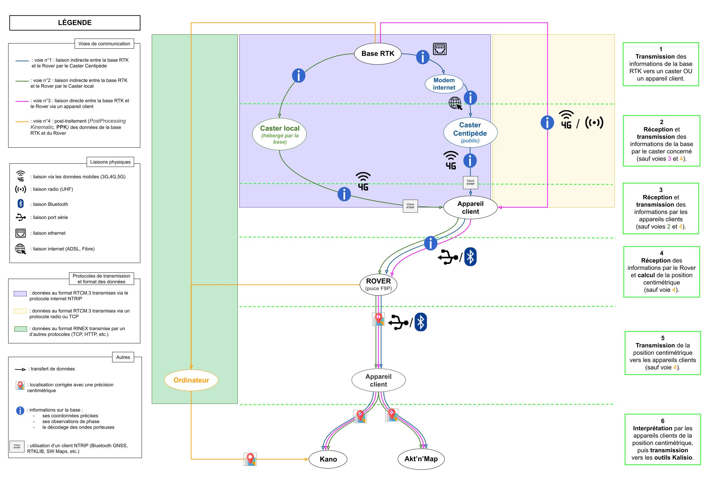

# L’organisation du réseau

***
 Schéma récapitulatif de l’organisation du réseau Centipède RTK 
***
*Sont visibles les appareils structurants, leurs voies de communication, les formats des données, les protocoles de communication utilisés et les étapes pour atteindre le positionnement centimétrique*