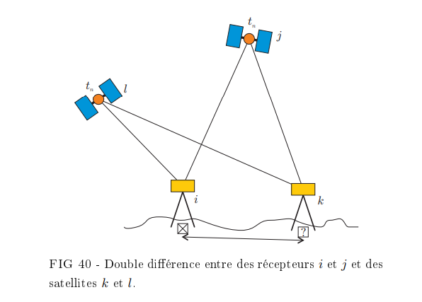

# La théorie
## Le calcul du déphasage
Le positionnement RTK se fonde sur le calcul du **déphasage**  entre le signal envoyé  par le satellite $\ j$ et le signal reçu par le récepteur $\ i$, selon la formule ci dessous :

$$l_i^j(t_r)=\lambda\Delta\varphi_i^j(t_r)=r_i^j(t_e,t_r)+c(\delta t_i-\delta t^j)+\tau_i^j(t_e,t_r)-\lambda N_i^j(t_r)+\varepsilon_i^j(t_r)$$

Où $\ l$ est la distance séparant le satellite et le récepteur, obtenu en multipliant le déphasage par la longueur d’onde du signal $\lambda$.

La mesure du déphasage est cependant entachée d’**incertitudes**. 

::: tip Remarque
Les ondes utilisées pour la mesure sont électromagnétiques. Leur célérité correspond à la vitesse de la lumière, soit $\ c=3.10^8 m.s^{-1}$. A cette vitesse, un retard de 1 seconde équivaut à un décalage de 300 mètres.
:::

La précision de la mesure est donc primordiale. Le positionnement RTK s’appuie sur de multiples outils mathématiques pour limiter les **biais** des mesures, et ainsi atteindre la meilleure précision possible.

## La distance géométrique
La distance géométrique $\ r$ est la distance séparant la position du satellite $\ j$ à l’instant d’émission du signal $\ t_e$ et celle du récepteur $\ i$ à l’instant de réception $\ t_r$. 

Les coordonnées $\ (x^j(t_e),y^j(t_e),z^j(t_e))$ du satellite à l’instant d’émission du signal  sont connues. 

Les coordonnées $\ (x_i(t_r),y_i(t_r),z_i(t_r))$ du récepteur à l'instant de réception sont inconnues

La distance géométrique $\ r$ est définie par :

$$r_i^j(t_r,t_e)=\sqrt{[x_i(t_r)-x^j(t_e)]^2+[y_i(t_r)-y^j(t_e)]^2+[z_i(t_r)-z^j(t_e)]^2}$$

Pour résoudre cette équation à 3 inconnues, les appareils de positionnement utilisent les signaux de 4 satellites en simultané.

## Les erreurs d’horloge
Les satellites, les bases et les rovers ont chacun une horloge qui mesure le temps dans leurs référentiels respectifs. Les décalages d'horloges sont donc inévitables.

Cependant, la technologie RTK est une méthode de **positionnement différentiel**. Elle fait appel à une base aux coordonnées connues qui communique simultanément avec l’appareil de réception et les satellites.

On parle même d’une **double différence**, car la communication est établie au minimum avec deux satellites en simultané. Cette double différence permet d’**éliminer les erreurs de synchronisation d'horloges $\ (\delta t_i ,\delta t_j)$**.  
  
  
***
 Principe de la double différence utilisée pour le positionnement RTK ([ENSG, 2013](http://cours-fad-public.ensg.eu/pluginfile.php/1501/mod_resource/content/1/gnss.pdf)) 
***
*La base RTK et le récepteur mobile communiquent simultanément entre eux et avec 2 satellites afin de rectifier les erreurs d’horloges.*

## Les retards à la propagation
Les retards à la propagation $\tau$ sont liés aux conditions atmosphériques, notamment dans la troposphère et l'ionosphère. Les signaux peuvent être ralentis, engendrant une imprécision de mesure. 

Les retards à la propagation sont estimés par calcul, et considérablement réduits dans le cas de positionnement différentiel avec une ligne de base (distance base - récepteur) inférieure à 50 kilomètres. Le positionnement double différentiel avec une ligne de base inférieure à 50 kilomètres, utilisé pour RTK, est donc très peu impacté par les retards à la propagation.

## La levée algorithmique des ambiguïtés
L'ambiguïté entière $\ N$ ou ambiguïté de la mesure de phase, est une notion complexe liée au déphasage. 

Pour la résoudre, les appareils de réception font appel à des algorithmes de résolution rapide nommés AROF (*Ambiguity 
Resolution On the Fly*).

## Le bruit
Le bruit $\varepsilon$ est négligeable dans le cas d’un positionnement différentiel.
