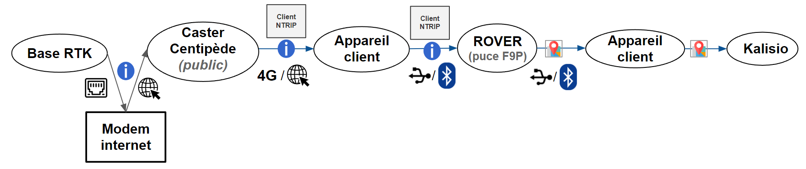
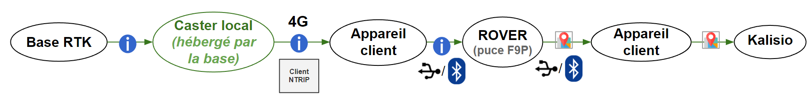
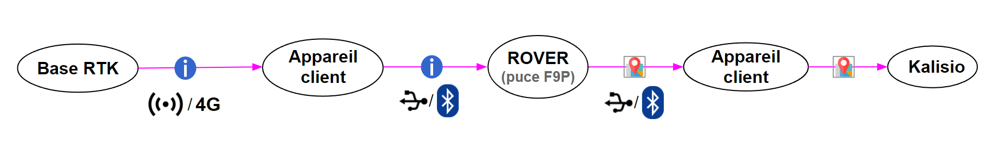
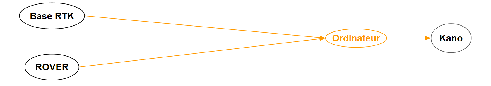

# Sur le terrain
## Les appareils structurants
### Les Bases RTK
Une base RTK est un récepteur GNSS fixe dont les coordonnées précises sont connues. 

Elle est connectée au caster Centipède et lui livre ses observations de phase, ses coordonnées et le décodage des ondes porteuses en vue de corriger le calcul de position des Rovers.

### Les Rovers
Les Rovers RTK sont des récepteurs GNSS mobiles capables d'interpréter les informations  transmises par la Bases RTK la plus proche. 

Ils en déduisent ensuite leur positionnement centimétrique qu’ils transmettent aux appareils clients (smartphone, ordinateur).

Certains Rover peuvent aussi être utilisés en tant que base temporaire.

### Les appareils clients
Les appareils clients (smartphones, ordinateurs, console de tracteur, récepteur radio etc.) ont la lourde tâche de transmettre au Rover les informations de la base RTK la plus proche. 

3 possibilités s'offrent aux appareils clients :
- Se connecter au caster Centipède OU au caster local hébergé par la base par données mobiles (3G, 4G) ou, plus rarement, par internet;
- Se connecter directement à la base par données mobiles (3G, 4G) ou internet;
- Se connecter directement à la base par onde radio;

Certains appareils clients (smartphones, ordinateurs, consoles de tracteurs) ont aussi la possibilité de visualiser la position centimétrique calculée par le rover.

### Le caster Centipède
Le caster Centipède est un serveur public où sont archivées en continu les informations des bases du réseau RTK, avec qui elles communiquent par internet.

Ces informations sont ensuite transmises aux appareils clients qui se connectent par internet au caster pour corriger la position des Rovers liés.

Toutes les données transitant par le caster public Centipède sont transmises au format RTCM.3 en suivant le protocole NTRIP.

::: tip Définition NTRIP
> “Le transport en réseau des trames RTCM via le protocole Internet (NTRIP) est un protocole permettant de diffuser des données GPS différentielles (DGPS) sur Internet conformément à la spécification publiée par RTCM” ([CGEOS, 2023](https://cgeosbe.weebly.com/ntrip.html)).
:::

### Les clients NTRIP
Les clients NTRIP sont des logiciels et applications capables de communiquer avec un caster NTRIP (comme le caster Centipède), afin d’obtenir la liste des bases RTK disponibles, et d’en extraire leurs informations (coordonnées, observations de phase, décodage onde porteuse).

*RTKLIB* sur ordinateur et *Bluetooth GPS* sur smartphone sont les clients NTRIP open-source les plus utilisés. 

::: tip Remarque 
*RTKLIB* est un logiciel très difficile à prendre en main. Il se compose de multiples briques technologiques qui permettent de réaliser un grand nombre de tâches, notamment le post-traitement ou le calcul de la position centimétrique à partir des observations d’un rover et de la base la plus proche !
:::

Pour les smartphones, l’équivalent de *RTKLIB* est l’application *RTKGPS+*. Les possibilités offertes par cette application sont très nombreuses, mais la rendent très peu intuitive. 

Je vous conseille donc d'utiliser *Bluetooth GNSS*, qui est moins complète mais bien plus pratique.

## Les 4 voies de communication
### Connexion indirecte à la base via le caster public Centipède 

Dans un premier temps, la base RTK envoie ses informations (coordonnées, observation de phase et décodage de l’onde porteuse) au caster Centipède par internet.

Ces informations sont ensuite transmises à un appareil client (smartphone, ordinateur, console de tracteur, etc.) connecté au caster Centipède grâce à un client NTRIP, qui les envoie enfin au Rover par Bluetooth ou port serie.

Une fois les informations de la base RTK reçues, le Rover corrige sa localisation par doubles calculs différentiels et par levée algorithmique des ambiguïtés de phase. Il re-transmet ensuite cette nouvelle localisation précise à l’appareil client.

::: warning Attention
Les appareils clients doivent être spécifiquement connectés à la base RTK la plus proche du Rover. Pour la trouver, il suffit de faire un détour par le carte intéractie du projet [Centipède](https://centipede.fr/index.php/view/map/?repository=cent&project=evolution), où vous trouverez toutes les bases actives proches de votre position.
:::

Cette première voie de communication est la plus commune. Jusqu'au rover, toutes les données y transitent au format RTCM.3 - qui permet de supporter les différentes fréquences utilisées par les satellites (L1, L3, et L5) - en suivant le protocole NTRIP.

Le format de la position corrigée envoyée par le rover peut être modulé. Dans la majorité des cas, les données sont transmises au format NMEA.

### Connexion indirecte à la base via le caster local

En cas de dysfonctionnement du caster public Centipède ou d’une impossibilité de connexion à celui-ci (souvent à l'étranger), certaines bases RTK sont capables d'héberger un caster local. Elles y archivent les informations nécessaires à la localisation des rovers environnants.

Grâce à un client NTRIP, un appareil client se connecte au caster local et y extrait les données nécessaires au positionnement centimétrique. Ces informations sont transmises par l'appareil client au rover, généralament par port série ou par bluetooth.

 La localisation corrigée est ensuite transmise aux appareils clients, comme dans le cas de la connexion par le caster Centipède. Toutes les données transitent aussi au format RTCM.3 en suivant le protocole NTRIP.

### Connexion directe vie TPC ou Radio

Lorsque le caster Centipède n’est pas disponible et que la base n’a pas la possibilité d’héberger un caster localement, cette troisième voie de communication prend tout son sens. 

Elle permet de transférer directement les données de la base au format RTCM.3 à un appareil client en suivant les protocoles radio ou TCP. Ensuite, les informations sont transmises au rover qui re-calcule sa position et renvoie son positionnement précis aux appareils clients.

### PostProcessing Kinematic (PPK)

Cette dernière voie de communication est particulière car elle ne calcule pas le positionnement en temps-réel. Le PostProcessing Kinematic (post-traitement cinématique en français) se fait en temps différé, au minimum 24h après le début de la collecte des signaux satellites.

Son fonctionnement est simple : une fois la collecte des données effectuée, il faut les extraire de la base et du rover. Pour la base, vous utiliserez la plateforme RTKbase qui lui est propre.

Ensuite, il vous faut convertir ces fichiers au format RINEX, et les traiter à l’aide du logiciel open-source RTKLIB. Toutes les étapes de la procédures sont expliquées ici, sur le site du [projet Centipède](https://docs.centipede.fr/docs/ppk/).
