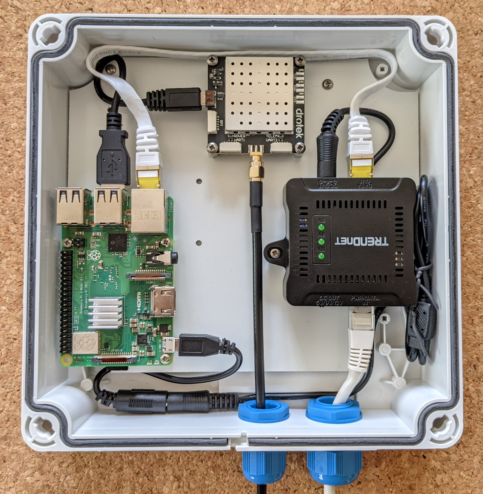
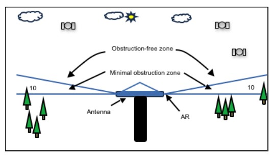
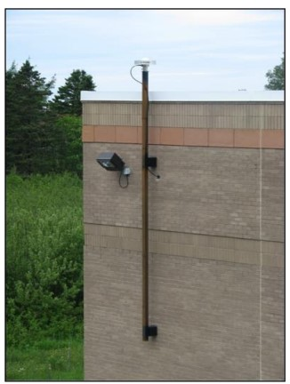

# Installer une base RTK
## Matériel et assemblage
Pour installer une base RTK, 2 possibilités s'offrent à vous :
- Acheter tous les [composants nécessaires](https://docs.centipede.fr/docs/base/Materiels.html) séparément 
- Acheter une [base en kit](https://rtkbase.eu/)

Ensuite, suivez le [tuto pour assembler votre base](http://rtkbase.eu/assemblage_base_gnss_brut.mp4).

**Spécificités pour le kit :**
- 4 entretoises blanches à placer autour des points de fixation du fond de panier qui supportent l'ensemble des composants.

- Pour fixer ce fond de panier par-dessus les entretoises, il faut utiliser les 4 vis fournies dans le sachet de visserie, et pas celles fournies avec le boîtier, car elles sont trop courtes. Ce sont 4 vis de type "tole" avec un pas plus important que les autres.

- Le cordon d'alimentation entre l'extracteur POE et la carte Orange Pi Zero est différent, il n'est plus qu'en une seule pièce.

- Lorsqu'on insère les pièces bleues sur le couvercle, il faut bien les pousser jusqu'à entendre un "clic". Ensuite on peut poser le couvercle, et tourner ces pièces à l'aide d'un gros tournevis plat.

:: danger ATTENTION 
Le sélecteur de tension de l'extracteur POE Trendnet TPE-104GS doit être placé sur 5 Volts**. Au-dessus de 5V, on grille les composants.
:::

*
Assemblage final de la base RTK
*

## Configuration système
Pour fonctionner, il faut configurer les différents modules de la base. Tout est parfaitement expliqué [ici](https://docs.centipede.fr/docs/base/Installation.html).

## Choix de l'emplacement
Les facteurs suivants doivent être pris en compte:
- Position très stable
- Privilégier sur un mur robuste (béton, porteur si possible) et ancien (plus de 5 ans)
- Veiller à ce que le support soit bien plan (niveau à bulles à utiliser) 
- Privilégier un mât en acier inoxydable (pas d'alu); 
- Visibilité des satellites : pas d’obstacles (bâtiments, arbres, murs …) au-dessus des 10 premiers degrés par rapport au plan horizontal de l’antenne
- Fixer l’antenne en hauteur, où la vue est dégagée

***
 Schéma explicatif de la visibilité nécessaire pour l’antenne ([Levés géodésiques du Canada, 2017](https://ressources-naturelles.canada.ca/sites/www.nrcan.gc.ca/files/earthsciences/pdf/MeilleuresPratiques_Station_de_Reference_GNSS.pdf)).
***
*Les obstacles ne doivent pas être visibles au-dessus des 10 premiers degrés de la ligne d’horizon, au risque de diminuer la qualité des signaux qu’elle transmet, et donc sa portée.*

- Aligner l'antenne avec le Nord;
- Éviter la proximité avec des sources de radiofréquences. Si impossible, à renseigner dans le registre du site;
- Alimentation électrique et moyens de communication à proximité  (accès à Internet via un câble ethernet).

***
 Exemple d’installation correcte d’une base RTK ([Levés géodésiques du Canada, 2017](https://ressources-naturelles.canada.ca/sites/www.nrcan.gc.ca/files/earthsciences/pdf/MeilleuresPratiques_Station_de_Reference_GNSS.pdf)).
*** 
*Ici, l’antenne est idéalement fixée sur un mât en acier inoxydable, en extérieur, avec une vue bien dégagée sur le ciel. Le corps de la base est caché à l’intérieur du bâtiment.*

## Calcul de la position millimétrique et certification par le réseau Centipède
Toutes les étapes sont expliquées sur les [site internet du projet Centipède](https://docs.centipede.fr/docs/base/positionnement.html).

::: warning Attention
Avant de calculer sa position, la base doit fonctionner en continu pendant un jour révolu, de 00h à 23h59.
:::