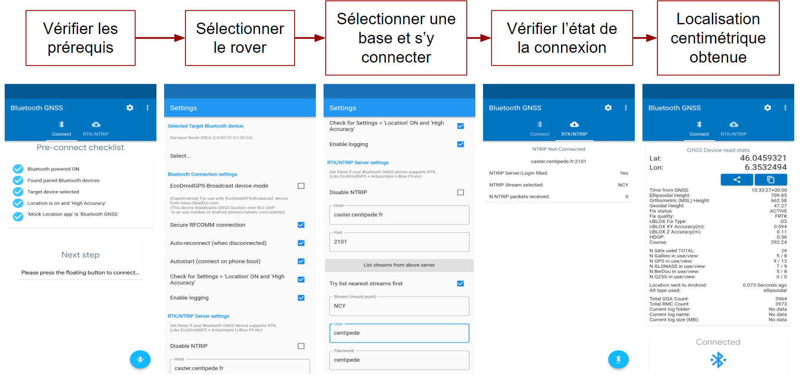
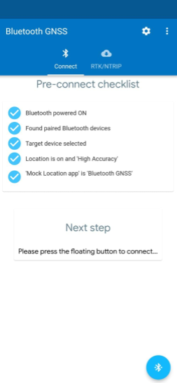
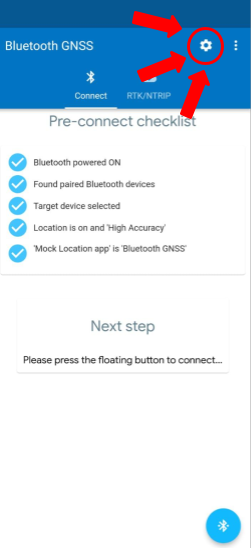
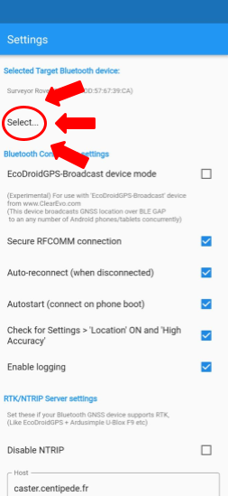
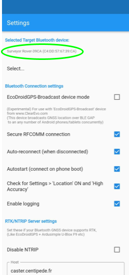
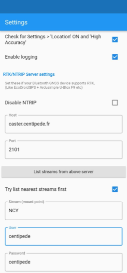
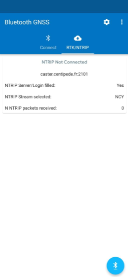
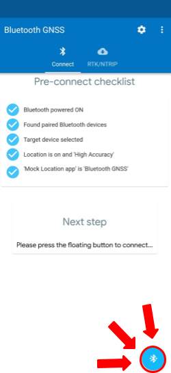
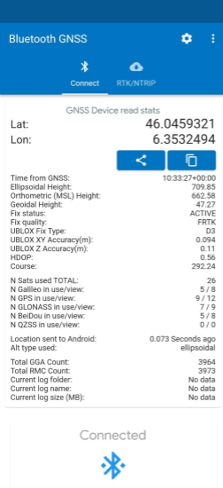

# Exploiter le positionnement précis
##  Akt’n’Map et *Bluetooth GNSS*
Utiliser directement le positionnement RTK sur l’application *Akt’n’Map* est impossible. Il faut donc faire appel à une application intermédiaire capable de répondre aux verrous technologiques suivants :

- Interpréter les signaux transmis par le rover;
- Contourner la localisation interne de l’appareil client pour lui imposer le positionnement centimétrique transmis par le rover.

L’application open-source *Bluetooth GNSS* en est parfaitement capable. Elle est disponible sur tous les appareils Android. Malheureusement, il n’existe pas d’application de ce type pour les appareils IOS, pour qui la localisation RTK n’est donc pas accessible.

::: tip Remarque
*Bluetooth GNSS* est une solution **open-source**. Le code est consultable sur [GitHub](https://github.com/ykasidit/bluetooth_gnss).
:::

*Bluetooth GNSS*, par la fonctionnalité “localisation fictive” (“mock-location”), peut contourner la localisation interne à l’appareil. Pour activer cette option, il faudra fouiller dans les options développeur de l’appareil.

*Bluetooth GNSS* est aussi un client NTRIP, capable de se connecter au caster Centipède et de transmettre au rover les informations d’une base par bluetooth.

## Fonctionnement de *Bluetooth GNSS*

***
 Les 5 étapes pour faire fonctionner Bluetooth GNSS sur votre smartphone Android 
***

### Vérifier les prérequis
Pour fonctionner et remplir ses missions, Bluetooth GNSS a besoin de quelques prérequis. Vous devez donc fouiller dans les paramètres de votre appareil pour :
- Activer le Bluetooth et vous appairer au rover;
- Activer la localisation de haute précision (paramètres localisation);
- Sélectionner Bluetooth GNSS comme application de localisation fictive (paramètres développeur).

Une fois tous ces paramètres vérifiés, vous devez préparer la connexion au rover.

### Sélectionner le rover
Pour préparer la liaison avec le rover, vous devez le sélectionner en amont de la connexion. Rendez-vous dans les paramètres de l’applications en cliquand sur l’engrenage blanc en haut à gauche de l’écran d’accueil.

Une fois la page des paramètres ouverte, cliquez sur “Select…” dans la catégorie “Selected Target Bluetooth device”  et sélectionnez le rover.

::: tip Remarque
Pensez à appairer votre smartphone et votre rover avant la manipulation.
:::

Si vous avez bien réalisé la manipulation, le nom de votre rover est visible sur la page des paramètres. S’il ne l’est pas, recommencez la manœuvre !

### Sélectionner une base et s’y connecter
Maintenant que la connexion avec le rover est amorcée, il faut sélectionner la base qui lui enverra les informations nécessaires au positionnement centimétrique.

Rendez-vous dans les paramètres de l’application, et faites défiler la page jusqu’à la section “RTK/NTRIP Server settings”. Entrez les informations suivantes : 
- Host : caster.centipede.fr
- Stream (mount-point) : entrez le nom de la base RTK la plus proche. Deux possibilités s’offrent à vous pour sélectionner la bonne base :
    - Entrer manuellement le nom de la base RTK en fonctionnement la plus proche en se référant au site du [projet Centipède](https://docs.centipede.fr/) ;
    - Cliquer sur “List streams from above server” et sélectionner la première base de la liste, qui est celle la plus proche de votre position selon les données de localisation de votre téléphone.
- Port : 2101
- User : centipede
- Password : centipede

***
 Dans cet exemple, j'utilise la base NCY 
***

### Vérifier l’état de la connexion
Une fois toutes les informations de la bases fournies, retournez sur l’écran d’accueil, section “RTK/NTRIP” et vérifiez qu’en face de la ligne “NTRIP Server/Login filled” soit indiqué “Yes”.

S’il est inscrit “No”, alors vérifiez bien les informations que vous avez saisies pour votre base.

### Localisation centimétrique
Une fois toutes ces étapes réalisées, connectez vous à votre rover en pressant sur le bouton bleu en bas à droite.

Patientez quelques secondes le temps de l’initialisation. Des coordonnées apparaissent à l’écran ? Vous avez réussi !

La précision de votre localisation dépend alors de la levée des ambiguïtés, visible sur la ligne "Fix quality" :
- **Single/DGNSS** = impossible de résoudre la partie calculatoire de l'équation de déphasage et impossible de lever les ambiguités => **précision faible** ;
- **FRTK** = impossible de lever les ambiguîtés mais la partie calculatoire de l'équation de déphasage est résolue => **précision moyenne** ;
- **RTK** = calculs et ambiguités résolues => **précision élevée**.

Vous pouvez ensuite profiter de votre positionnement RTK dans Akt’n’Map !

